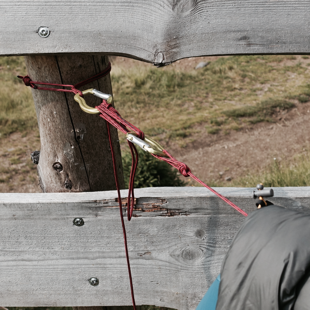

7 Dinge, die ich während meiner „Auszeit“ auf der Alm gelernt habe
##################################################################
:date: 2015-08-03 10:00
:author: sascha
:category: Geist
:status: published

Kennt ihr das Gefühl, dass von allen Seiten jemand an euch zerrt? Dass Gefühl, dass ihr gar nicht zur Ruhe kommt und grad gar nicht bei euch selbst seid? So ging’s mir vor ein paar Wochen. Ich hatte das starke Bedürfnis mal aus den Mühlen des Alltags auszusteigen. Da viel mir ein, dass mir mal ein kanadischer Freund von einsamen Hütten am See erzählt hat, die man in Kanada mieten kann. Also hab ich Google angeschmissen und nach „einsame Hütte mieten“ gesucht und war erst mal total überrascht von der Menge an Treffern die es gibt. Nach kurzer Suche hatte ich auch schon eine Hütte in Kärnten gefunden. Auf 1626m, fernab jeder Zivilisation. Ohne Strom (außer einer Solarzelle für Licht) und Heizung. Wenn man warmes Wasser will muss man den Ofen anschmeißen. Den benutzt man auch gleichzeitig zum Kochen. Außerdem war die zu der Zeit frei, wo ich hin wollte. Also gleich mal gebucht.

Vor 3 Wochen war es dann so weit. Am Sonntag habe ich mich nach Kärnten auf gemacht und war gegen 18:00 auf „meiner“ Hütte und off-the-grid. Dort habe ich eine ganze Woche alleine mit mir und ein paar Büchern verbracht, um mal wieder zur Ruhe und zu mir selbst zu finden.

So eine Auszeit ist ein besonderes Erlebnis, bei dem einem auch die ein oder andere Erkenntnis kommt. Ich möchte einige meiner mit euch teilen.

1) Langfristiges Planen lohnt sich nicht
~~~~~~~~~~~~~~~~~~~~~~~~~~~~~~~~~~~~~~~~

Eigentlich war für diese Woche was ganz anderes vorgesehen. Wenn es so gekommen wäre, wie ich’s vor nem guten halben Jahr geplant hatte, wäre ich in der Zeit mit dem Mountainbike in Alpes d’Huez unterwegs gewesen und hätte mich auf der Megavalanche den Berg runtergestürzt. Das war der Plan. Es waren schon alle Anmeldungen bestätigt und die Bude war bezahlt.

Aber das war halt im Moment nicht angesagt. Also hab ich die Kohle abgeschrieben und habe stattdessen das gemacht, von dem ich genau gespürt habe, dass ich das brauche.

Also, lieber spontan und kurzfristig schauen, was grad angesagt ist und darauf reagieren, anstatt ewig lange im Voraus was zu planen, was dann doch nicht passt.

2) Dein Weg ist dort, wo deiner Angst ist
~~~~~~~~~~~~~~~~~~~~~~~~~~~~~~~~~~~~~~~~~

Auch wenn Angst in dem Fall etwas viel gesagt ist. Als es ans konkrete Packen ging, kamen dann doch so die Fragen wie „wie wird das eine Woche alleine?“, „kommst du eigentlich alleine mit dir klar“, „was wenn die Zeit nicht rum geht“, „was wenn dich die Einsamkeit verrückt macht?“. Das übliche Kopfkino halt. Irgendwann habe ich mir dann gesagt „wenn du’s nicht machst, wirst du’s nie rausfinden!“. Also die „Bedenken“ oder die Angst sind genau die Gründe weshalb man was machen sollte. Das Glück liegt jenseits der Komfortzone. Es bringt einen weiter, wenn man’s doch durchgezogen hat. Und mal ganz ehrlich, was ist denn das Schlimmste, was passieren kann…?

3) Man kriegt nicht immer was man will, aber oft das, was man braucht
~~~~~~~~~~~~~~~~~~~~~~~~~~~~~~~~~~~~~~~~~~~~~~~~~~~~~~~~~~~~~~~~~~~~~

Mir ist es im Leben schon oft so gegangen, dass ich zur richtigen Zeit das richtige bekommen habe. Selbst wenn es im ersten Moment nicht immer das ist, was man sich wünscht, so kommt rückblickend betrachtet zur rechten Zeit immer das Richtige. Dass was anderes angesagt war, als Biken habe ich oben ja schon geschrieben. Witzig fand ich, dass mein Vermieter mich gefragt hat vor wie vielen Monaten ich denn gebucht hatte? Ich so: „Monate? Vor 2 Wochen“. „Da haben sie aber Glück gehabt. Normalerweise sind wir ein halbes Jahr im Voraus ausgebucht“. Manchmal passt es halt einfach.

Völlig unabhängig von meinem Hüttenbesuch hat mir ein Freund ein Buch gegeben: "Logbuch für Helden: Wie Männer neue Wege gehen" von Cristián Gálvez. Ich hab es einfach mal eingesteckt, ohne genau zu wissen, worum es geht. Als ich angefangen hatte zu lesen, habe ich gemerkt, dass es ein super Begleiter für die Woche war, der mir Kapitel für Kapitel schöne Denkanstöße gegeben hat, die ich während der „Auszeit“ so richtige schöne habe setzen lassen können. Manchmal passt es halt einfach.

Also, einfach mal drauf vertrauen, dass das Leben schon das Richtige bereit halten wird.

4) Improvisiere, Vertraue auf dich
~~~~~~~~~~~~~~~~~~~~~~~~~~~~~~~~~~

Männer, mal ehrlich, gibt es was geileres, als irgend was mit den eigenen Händen zu bauen und sich danach zufrieden sein Werk anzuschauen? Ich habe bewusst wenig mit auf die Hütte genommen, weil ich mit den paar Sachen, die ich dabei hatte auskommen wollte.

Und egal, was ihr denkt, ich war saumäßig zufrieden mit meiner improvisierten Wäscheleine. Ich habe jedes Essen genossen, das ich nur mit Salz, Pfeffer und gelegentlich Knoblauch gewürzt habe und auf meine Konstruktion den Wasserstrahl des Brunnens im Zaum zu halten war ich einigermaßen stolz. Und das alles ohne Strom, hochtechnisierte Werkzeuge, Internetrecherche und Chefkoch.de. Ich habe einfach meiner Phantasie freien Lauf gelassen und ein paar Sachen probiert. Wenn was nicht geklappt hat, hab ich’s einfach anders probiert. Bis es ging.

Mir hat es jedenfalls tierisch Freude gemacht meine fast schon kindlichem Forscher- und Entdeckerdrang nachzugehen.

5) Gehe raus in die Natur und mach sie dir bewusst
~~~~~~~~~~~~~~~~~~~~~~~~~~~~~~~~~~~~~~~~~~~~~~~~~~

Wann habt ihr denn das letzte mal einfach da gesessen und Tiere beobachtet? Wann das letzte mal unter freiem Himmel geschlafen? Wann vor einem alten Baum gestanden und euch seine Präsenz bewusst gemacht? Schon ne Zeit lang her? Dann solltet ihr das schleunigst mal wieder tun.

In der Natur zu sein und sie sich bewusst zu machen erdet ungemein und gibt wahnsinnig viel Energie. In den Bergen bei klarer Nacht draußen zu liegen, in absoluter Dunkelheit und die Weite und Unendlichkeit des Sternenhimmels zu spüren, gibt vielem die Bedeutung, die es wirklich verdient. Einem uralten Baum, der Wind und Wetter überstanden hat, ist es völlig wurscht, wer wir sind, welche Autos wir fahren und wie viel Geld wir auf dem Konto haben. Er ist einfach da und gibt uns seinen Sauerstoff.

Und das beste daran: dafür muss man nicht 7 Tage in die Berge fahren. Mann muss einfach nur mal raus gehen und sich die Natur bewusst machen. Dazu reicht schon ein Spaziergang am Abend.

6) Babyschritte
~~~~~~~~~~~~~~~

Also, ich bin nach einer Woche nicht weise und erleuchtet aus den Bergen zurückgekommen, aber ich habe aber viele kleine Einsichten gehabt und ein paar Impulse für mein Lebend mitgebracht. Und das ist auch gut so. Weil das Schöne daran ist: Es muss nicht immer die lange Auszeit sein um weiterzukommen. Ich denke wenn man, einfach mal einen Tag bewusst als Auszeit nimmt, kommen schon neue Impulse und Gedanken. So was lässt sich immer leicht umsetzen. Und viele kleine Auszeiten bringen dich auch weiter.

7) Friends will be friends
~~~~~~~~~~~~~~~~~~~~~~~~~~

Ich habe einen Freund, der in Kärnten lebt. Da wir uns eher selten sehen, bot sich die Gelegenheit für ein Treffen natürlich an. Wir haben vereinbart, dass wir uns an meinem letzten Hüttentag vor der Abreise bei „mir“ oben treffen.

Ich habe mich wahnsinnig auf und über unser Treffen gefreut. Wir hatten einen tollen Tag. Haben den ganzen Tag über bedeutsames und belangloses gequatscht. Haben gekocht, Wein getrunken und haben einfach nur die Zeit genossen.

Egal, wie gut eine Auszeit und die Einsamkeit tut, der Mensch ist doch ein Herdentier. Wir brauchen soziale Kontakte. Also, hegt und pflegt eure Freunde. Haltet Kontakt mit den Menschen die euch gut tun. Ihr müsst nicht alleine durchs Leben gehen.

Lieber Gernot, vielen Dank für den tollen Tag!

Fazit
~~~~~

Eine Auszeit? Auf jeden Fall empfehlenswert. Ich habe für mich entschlossen so etwas regelmäßig zu tun. Egal, ob eine Woche „off the grid“ oder nur mal kurze Zeiten für mich. Mir hat die Zeit unglaublich gut getan und ich habe einige Einsichten gewonnen.

Also, packt euer Bündel(chen) und nehmt euch einfach mal Zeit für euch!

   Mein Reich für eine Woche
