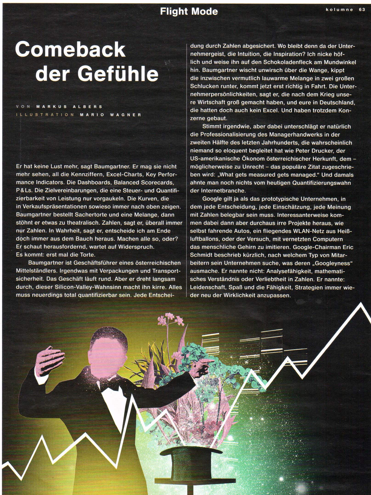
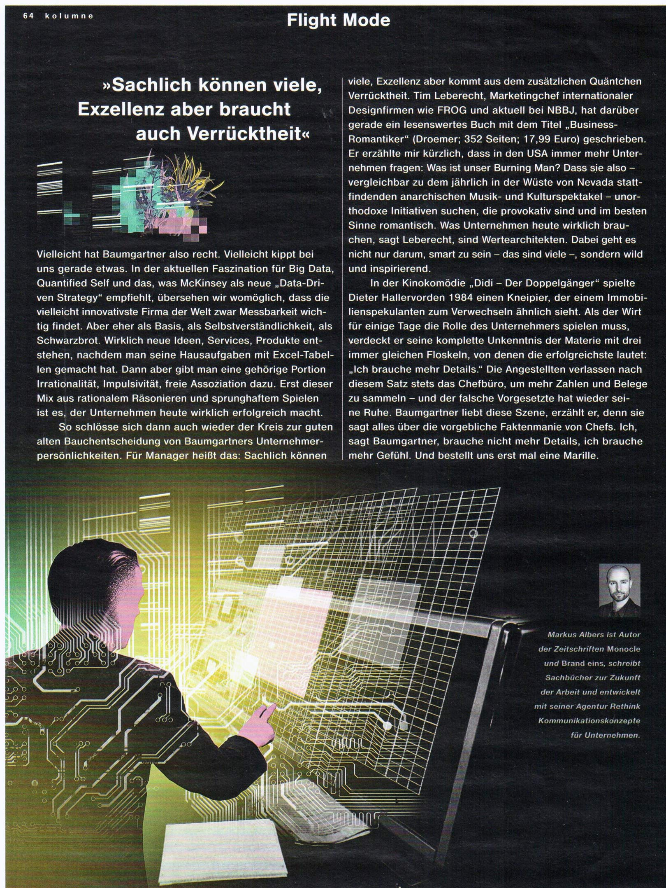

Comeback der Gefühle
####################
:date: 2015-05-10 20:11
:author: sascha
:category: Inspiration
:status: published

Ich bin neulich über die Kolumne "Comeback der Gefühle" von Markus Albers gestolpert (erschienen ist sie im Lufthansa Magazin).

Der Text thematisiert auf sehr unterhaltsame Weise, dass das KPI gesteuerte Management von Unternehmen vielleicht doch nicht der Weisheit letzter Schluss ist. Den Text (als Scan) wollte ich euch nicht vorenthalten, da er meiner Meinung nach den Finger in eine Wunde legt, die in vielen Unternehmen offen ist. Anstatt sich auf das Gefühl und die Erfahrung von Unternehmern (und nicht Managern) zu verlassen, befragt man lieber KPIs, da diese ja vermeintlich sichere Werte liefern. Und da Zahlen ja bekanntlich nicht lügen, braucht man sich keine große Gedanken mehr zu machen. Die Sache mit der Verantwortung wird damit auch ein gutes Stück entspannter: "Die Zahlen haben eine eindeutige Sprache gesprochen...". Damit werden Inspiration, Visionen und Unternehmergeist oft schon im Keim erstickt.

