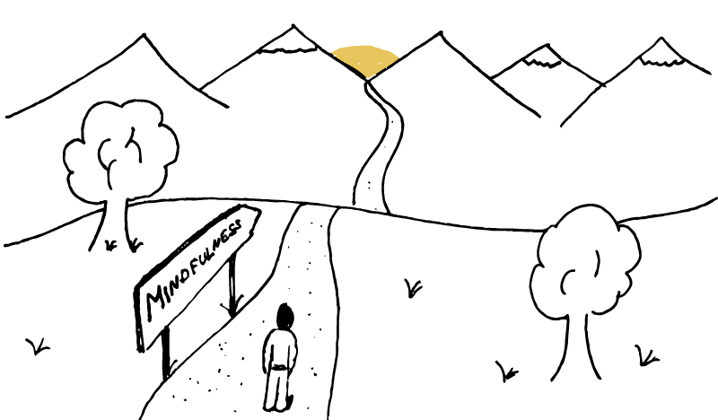

„Journey to Mindfulness“ - Wohin reisen wir eigentlich?
#######################################################
:date: 2015-05-21 11:50
:author: sascha
:category: Verschiedenes
:status: published

| *„Eine Reise von tausend Meilen beginnt unter deinem Fuß“.* Das wusste schon Laozi im 6. Jh. v. Chr. Die Frage ist jedoch, wo die „Journey to Mindfulness“ hingehen soll, bzw. was Mindfulness eigentlich ist.
| Wikipedia hält dafür folgende Definition bereit:

   „Achtsamkeit (engl. mindfulness) kann als Form der Aufmerksamkeit im Zusammenhang mit einem besonderen Wahrnehmungs- und Bewusstseins­zustand verstanden werden, als spezielle Persönlichkeitseigenschaft sowie als Methode zur Verminderung von Leiden (im weitesten Sinne).“

Diese Definition beschreibt zwar das Ergebnis und daraus lässt sich auch vieles ableiten. Mir ist das aber irgendwie nicht konkret genug. Da muss was griffigeres her.

Beim Betrachten des `Holstee Manifestos <https://www.holstee.com/pages/manifesto>`__, kam mir die Idee ein Mindfulness-Manifesto für mich selbst zu erstellen. Das ist der Versuch den Begriff für mich etwas greifbarer zu machen und Prinzipien zu formulieren, nach denen ich leben möchte.

Mein Mindfulness Manifesto
^^^^^^^^^^^^^^^^^^^^^^^^^^

Körper und Geist
''''''''''''''''

-  Ich lebe in Einklang mit der Natur und meinem inneren Ich.
-  Ich bin klar in meinem Tun und weiß, was ich will und was nicht.
-  Ich kann mir die Kraft der Natur und Spiritualität zu Nutze machen
-  Ich lebe gesund und tue meinem Körper und Geist Gutes
-  Ich bin neugierig, interessiert, offen und tolerant.
-  Ich entziehe mich dem sinnlosen Konsum und Besitz.

Beziehungen
'''''''''''

-  Ich konzentriere mich auf Leute anstatt auf Dinge.
-  Ich pflege meine Freundschaften in der realen Welt und nicht in der virtuellen
-  Ich widme meinem Gegenüber meine volle und ungeteilte Aufmerksamkeit.
-  Leute, denen ich begegne, behalten mich in positiver Erinnerung.
-  Ich begegne Leuten mit Respekt und Offenheit
-  Ich suche das verbindende Element und nicht das differenzierende.
-  Ich helfe so gut ich kann, wenn mich jemand darum bittet.
-  Bei zwei möglichen Interpretationen, wähle ich die positive.

Raum und Zeit
'''''''''''''

-  Ich nutze die Zeit, die ich auf dieser Erde habe.
-  Ich bereue nicht die Dinge, die ich nicht getan habe.
-  Ich entdecke die Welt und lasse mich von ihr inspirieren.

Die Reise kann beginnen
^^^^^^^^^^^^^^^^^^^^^^^

Das ist für mich wesentlich greifbarer, auch wenn es die ursprünglichen Definition von Wikipedia stark aufweicht. Aber damit kann ich für mich persönlich etwas anfangen. Es beschreibt welcher Mensch ich in Zukunft sein will und macht ganz klar deutlich, dass es bis dort hin an einigen Stellen noch eine lange Reise ist.

Ich freue mich auf jeden, der mich auf der Reise begleitet und hoffe, dass ihr auch für euch was mitnehmen könnte.
