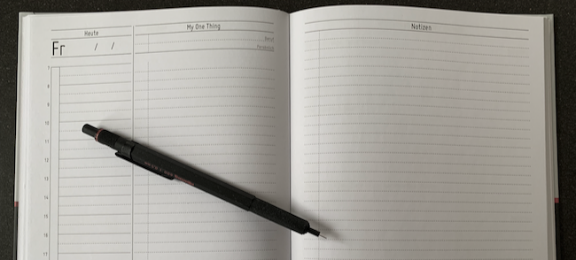

Mein eigener Planer entsteht
############################
:date: 2019-06-11 17:25
:author: sascha
:category: Planer, Produktivität
:status: published

In den letzten Monaten, ja sogar Jahren habe ich ziemlich viel mit Planern und Notizbüchern experimentiert. Immer wieder bin ich zwischen unterschiedlichen Ansätzen und Formaten hin und her gewechselt. Inklusive einem regelmäßigen Wechsel zwischen digital und analog. Mein Ziel war es einen guten Workflow zu finden um mich zu organisieren. Folgende Ansätze habe ich probiert (mit meinen Erfahrungen)

Getting Things Done
-------------------

Für mich ein toller Ansatz um Aufgaben zu organisieren. Das Verwalten von Notizen und „Gedanken“ habe ich damit nicht gut hinbekommen

Bullet Journal / Good Notes
---------------------------

Unheimlich flexibles und simples System. Mir ging es aber ziemlich auf die Nerven, dass ich die Vorlagen wieder und wieder „malen“ musste. Vor allem den Tagesplaner. Ich habe mir für’s iPad ein paar digitale Good Notes Vorlagen erstellt, aber Stift und Papier funktionieren für mich einfach besser.

Full Focus Planner (FFP)
------------------------

Ein gutes und mächtiges System, das besonders gut funktioniert wenn man sich auf das gesamte Michael Hyatt Universum einlässt. Der Planer ist top gemacht, sehr durchdacht und von hoher Qualität. Es gibt jedoch ein paar Bereiche, die ich überhaupt nicht benutze:

-  Goals: Mir ist das zu unübersichtlich. Ich muss die Übersicht (Jahresmotto, Quartalsziele,…) außerhalb des FFP pflegen. Außerdem plane ich meine „Ziele“ nicht auf dem Detaillevel in meinem Planer. Die kommen mit den Aufgaben nach OmniFocus
-  Weekly Review: Das passt nicht so recht mit meinem Gesamtworkflow zusammen
-  Monthly Calendar: Dafür habe ich einen digitalen Kalender in Outlook
-  Rolling Quarter: Dafür habe ich keine rechte Anwendung

Das in Kombination mit den exorbitanten Versandkosten aus dem USA machen den Planer insgesamt unattraktiv für mich.

The One Thing
-------------

Was mir hier besonders gut gefällt is das Konzept des „Goalsetting to the now“. Die Sometimes Goals und Jahresziele geben einen guten Überblick. Über die Quartale kann man sie sehr gut auf die Monate runterbrechen und Verteilen. Leider funktioniert der „One Thing Planner“ nicht für mich. Damit komme ich für die tägliche Planung überhaupt nicht zurecht.

Mein Planer
-----------

Mit keinem Ansatz war ich also so richtig zufrieden. Daher habe ich entschlossen, einfach einen eigenen Planer zu gestalten. Mein erster Testdruck ist jetzt angekommen und ich bin mit dem Ergebnis sehr zufrieden. Jetzt werde ich meinen Ansatz erst mal ausprobieren und iterativ verbessern. Diese Entwicklung möchte ich mit euch teilen und wenn ihr Ideen oder Anregungen habt, lasst es mich wissen. Vielleicht kommt ja was dabei raus, das für mehr Leute als für mich trägt.
