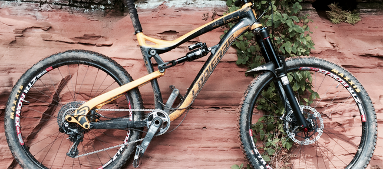

Mountainbiken ist meine Meditation
##################################
:date: 2016-04-19 21:25
:author: sascha
:category: Geist, Körper
:status: published

Seit ein paar Tagen bin ich in einer ganz komischen Stimmung. Ich trage das Gefühl mit mir herum, dass ich in einem Aspekt meines Lebens am falschen Platz bin, ohne einen richtigen Griff dran zu kriegen, wo, was und warum. Diese Stimmung sorgt dafür, dass ich völlig aus meinem inneren Gleichgewicht geraten bin. Ich stehe weit neben meiner inneren Mitte und mein Geist ist permanent auf Trap und am Arbeiten. Das hat mich in den letzen Tag zunehmend gestresst.

Alles was ich probiert habe, um Ruhe reinzubringen hat nicht wirklich geholfen. Weder Yoga, noch Meditation haben zum Erfolg geführt.

Heute morgen beim Frühstück war mir klar, dass ein Tag im Büro heute nicht von Erfolg gekrönt sein würde. Daher bin ich einem Impuls gefolgt, den ich hatte. Die Sonne kam grade raus und ich dachte „eigentlich müsstest du heute biken.“ Also habe ich mir spontan einen Tag Urlaub genommen, um in den nahegelegenen Pfälzer Wald zum fahren, um mich dort auszutoben.

.. image:: /images/2016-04-19_IMG_1613.png
   :class: image-process-article-image
   :align: center
   :alt: Mittagspause

Schon als ich das Rad auf den Radträger gepackt habe, konnte ich spüren, wie meine Laune besser wurde.
Die Fahrt zum Beckenhof bei guter Musik und Sonnenschein haben ihr übriges getan. Gut gelaunt bin ich zu einer 4stündigen
Tour aufgebrochen. Unterwegs wurde mir bewusst, dass das genau die Aktivität war, die ich gebraucht habe. Mit jedem Meter
hat sich das Gedankenkarussell langsamer gedreht und nach und nach wurde mein unruhiger Geist ruhiger bis es irgendwann
nur noch das Fahrrad, den Trail und mich gab. Ich bin immer wieder erstaunt darüber, welche Kraft und Energie die Natur mir geben kann.

Am Ende war ich total kaputt, aber glücklich und zufrieden am Auto. Einen Griff habe ich zwar immer noch nicht an der Frage, was grad los ist, aber ich habe das gute Gefühl etwas für meinen Geist und meinen Körper getan zu haben. Das gibt mir wieder Kraft und Zuversicht, dass sich der Rest auch irgendwann zeigen wird.

Diesen Effekt habe ich nur beim Biken - alleine. So gerne ich mit meinen Kumpels Rad fahre. In Zukunft werde ich mir wieder öfter solche Einheiten einbauen müssen um wieder besser zu mir finden zu können.

Eins ist mir auch wieder klar geworden: Es ist egal, was „man“ so tut um achtsam zu sein und was grade hip ist. Letztlich ist es wichtig, dass jeder sein Ding findet, bei dem er diese Ruhe findet.

Was tut ihr, um euren unruhigen Geist im Zaum zu halten?
