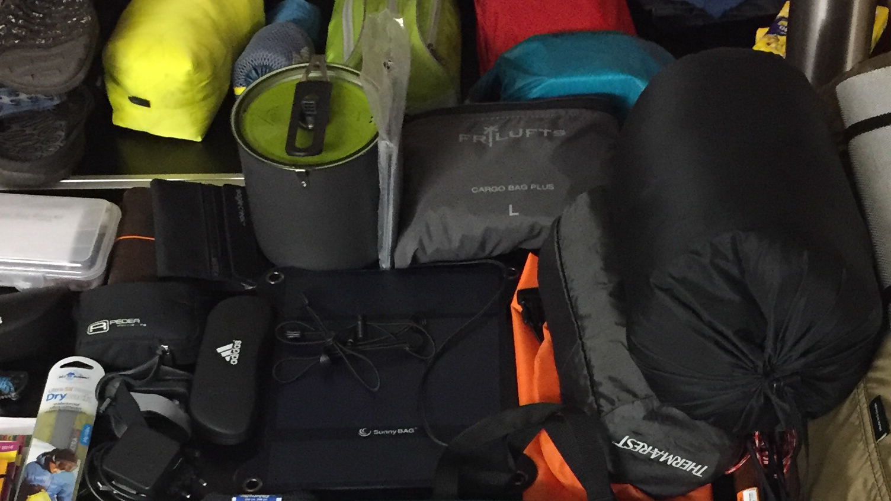

Packliste für eine Mehrtagestour in Schweden
############################################
:date: 2019-09-05 18:10
:author: sascha
:category: Packliste, Reise, Trekking
:status: published

2017 haben wir den nördlichen Teil des Kungsleden bewandert und kommen frisch vom Padjelantaleden zurück. Für meine Kungsleden Packliste hatte ich damals ziemlich viel Recherche betrieben. Daher habe ich mich jetzt - zwei Jahre später - mehr oder weniger auf sie verlassen. Geändert habe ich nur ein paar Kleinigkeiten. Alles in allem hat meine Ausrüstung hervorragend funktioniert. Ein paar Details habe ich angepasst, aber so würde ich jederzeit wieder auf einen Fernwanderweg bzw. auf eine Mehrtagestour in Nordschweden starten.

Die List ist für folgende Voraussetzungen entstanden:

-  Der Weg ist gut definiert und man kann sich leicht orientieren
-  Unsere bevorzugte Reisezeit für die Region ist Mitte August - Mitte September
-  Es ist einigermaßen klar, wo man Verpflegung nachkaufen kann
-  Hütten (bzw. Hilfe ist immer nur einen Tagesmarsch entfernt)
-  Wir sind mit Zelt unterwegs, machen aber eine Kombination aus Zelt und Hüttenübernachtungen
-  Da wir zu zweit sind, ist das Zelt auf 2 Personen ausgelegt, die auch bequem darin mal nen Tag aushalten können wenn's regnet
-  Das Equipment ist nicht auf "Ultra Light" getrimmt. Mir ist klar, dass es an einige Stellen Optimierungspotential gibt. Ich fühle mich aber mit dem Gewicht (noch) OK und habe alles in Benutzung, was im Rucksack ist

| Mit anderen Worten: Für eine Sarek-Durchquerung würde ich die List ein wenig abwandeln (wenngleich die Basics bleiben).
| Bevor es zu den Downloads geht noch ein paar Kommentare:

Kleidung
~~~~~~~~

-  Mann kann trefflich darüber streiten, ob man 2 Paar lange Unterwäsche braucht. Ich nehme sie mit. Ein Paar (3/4 Unterhose und Berghaus Shirt lang) dienen ausschließlich der Übernachtung. Ich mag es einfach wenigstens Nachts Klamotten zu tragen, die nicht schon durchgeschwitzt sind
-  Ob man mit 2 Merinounterhosen für die Wanderung auskommt muss jeder für sich entscheiden. Mir reicht es. Je nach Tourlänge werden die umeinander gewaschen
-  Ja, ich weiß, die Fjällräven Keb-Jacke ist sackschwer und manche schwören auf Shirt + Hardshell als Kombi. Ich persönlich mag nicht in ner Mülltüte wandern, wenn es nicht sein muss (sprich nicht regnet). Daher nehm ich sie mit und ich muss sagen, ich liebe diese Jacke. Sie ist super bequem, hält den Wind an den richtige Stellen ab und ist ideal belüftet (vor allem das atmungsaktive Gewebe im Rückenbereich ist ein Traum)
-  Fleece + Hohlfaserjacke: Der Fleece ist top für Pausen und die Hohlfaserjacke nett abends im Camp. Ich bin seit kurzem ein stolzer Besitzer eines Houdini Power Houdi. Ich überlege mal, ob ich nicht Fleece + extra Jacke durch den Houdi ersetze. Bin mir aber umsicher ob das warm genug ist (insbesondere, wenn man keine Hütte hat) - Für ne reine Hüttentour reicht das sicherlich

Apotheke
~~~~~~~~

-  In die Reiseapotheke gehören (mindestens): Mückenzeugs, Fenestil (sie erwischen dich ja doch), Voltaren, Tape, Durchfallmittel und Schmerzmittel

Ausrüstung
~~~~~~~~~~

-  Meine „Gearbox“ enthält Kleinkram, wie ein Mini Multitool, Nähzeug, Panzertape, Kabelbinder, Ersatz-Zeltspanner, ein Feuerstahl und sonstiges Kleinzeugs
-  Die Powerbank brauche ich für die Fenix, die als Navi und Tracker dient. Braucht ungefähr alle 2 Tage eine Ladung
-  Der Rucksack ist auch hackeschwer. Aber ich liebe meinen Fjällräven Kajka 75 einfach
-  Auch über das Zelt kann man streiten. Aber wenn man mit 2 Personen mal einen Regentag auswettern muss, ist man sehr sehr glücklich damit. Aber wer’s kleiner mag…
-  Das Seideninlet für den Schlafsack hat 2 Funktionen: Es schützt den Schlafsack vor Verschmutzung (und ist einfacher zu waschen) und bietet einen Wärmereserve (da der Schlafsack nur eine Wohlfühltemperatur bis +2° hat)
-  Pumpsack für Isomatte ist toll, wenn man 2 aufblasen muss, braucht man aber nicht unbedingt

Küche
~~~~~

-  Kochsystem: Wir gehören zu der Kategorie „Trekkingnahrungs Esser“. Daher muss der Kocher im Wesentlichen nur Wasser heiß machen. Dafür ist der Primus Lite+ ideal geeignet
-  Die Ortlieb Faltschüssel, braucht man zwar auch nicht unbedingt, aber um im Zelt am Abend schon das Zeugs für’s Abendessen und den nächsten morgen zu organisieren und alles in einem transportieren zu können ist das Teil einfach Gold wert. Das war eine bisher sehr lohnende Investition
-  Je nach Region reicht eine kleine Wasserflasche. In Schweden braucht man eigentlich nie mehr als 500ml Wasser als Reserve. Da kommt man mit der 500ml Thermosflasche auch gut aus. Ne 1l Flasche ist halt abends am Camp sehr pratkisch

Essen
~~~~~

-  Das Essen muss jeder selbst wissen. Ich habe für mich festgestellt, dass ich so ca 3000-3500 kCal am Tag brauche. Da muss man schon ordentlich was reinstopfen. Die bewährte Kombi ist: Müsli + Riegel + Süßkram + Trockenfrüchte + Nüsse + Trekking Abendessen

Links zu den Packlisten
~~~~~~~~~~~~~~~~~~~~~~~

-  `Packliste als Apple Numbers Datei <downloads/Packliste-Trekking-Schweden-Fernwanderwege.numbers>`__
-  `Packliste als PDF <downloads/Packliste-Trekking-Schweden-Fernwanderwege.pdf>`__
