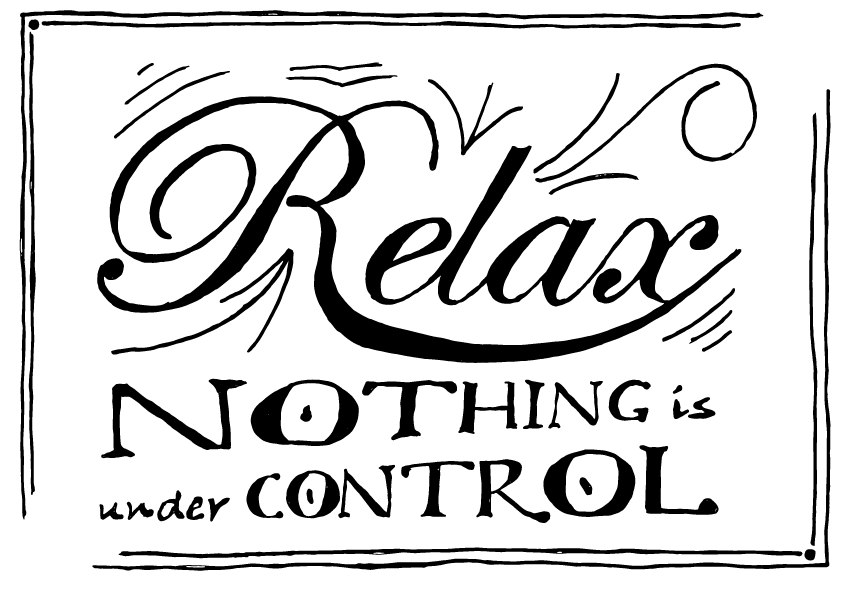

Relax - Nothing is under control
################################
:date: 2015-05-08 10:37
:author: sascha
:category: Handlettering, Inspiration
:status: published

Es gibt weder absolute Sicherheit, noch absolute Kontrolle (auch wenn uns Werbung und Versicherungen insbesondere ersteres gerne glauben machen wollen).

Die wohl bekannteste Form des Spruchs "Erstes kommt es anders und zweitens, als man denkt" hat sicher jeder schon mal gehört. Letztendlich meinen aber alle Abwandlungen das Gleiche: Es ist unnötig sich zu viele Gedanken zu machen, denn niemand weiß, was die Zukunft bringt und man hat nur bedingt Kontrolle darüber, egal wie sehr man es probiert.

Also, ihr lieben Perfektionisten, Kontrollfreaks und Sicherheitsfanatiker, ihr könnt euch genauso gut entspannen. Die Sonne wird auch morgen wieder aufgehen. Selbst wenn die Wohnung nicht 100% aufgeräumt ist, dem Chef die letzte Präsentation nicht gefallen hat, ihr wieder keinen Sport gemacht und anstatt dem gesunden Salat ein Stück Torte verdrückt habt. Vom Mond aus betrachtet ist das alles nicht so dramatisch, wie ihr vielleicht denkt.
