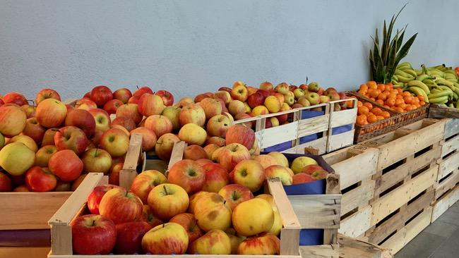

SAP d-kom 2020 - Personal Recap and why sustainability and ethics stood out to me
#################################################################################
:date: 2020-01-10 12:48
:author: sascha
:category: Inspiration, Verschiedenes
:status: published

The SAP „Development Kick-Off Meeting“ (aka d-kom) is always a very exciting event. It’s a great start into the new year. I find it always inspiring, to get out of the day-to-day business. I like the opportunity to step back and look at the bigger picture of what we’re doing and where we’re heading as a company. Despite the usual display of the latest and greatest from the technology and product teams, one thing stood out to me this year. That was the discussions about ethics, sustainability and social responsibility.

It was the first time,  these „non-technical“ topics where prominently represented at the event. I already noticed, they increasingly slip into my work as a developer and I like that a lot.

| It already started with the keynote. Thomas Saueressig emphasized, that we have to add sustainability as a dimension of success (besides business model innovation and operational excellence). This was the first time, I recall this topic being represented in a keynote at d-kom. I’m so excited,  that this gets more and more traction on the strategic level. SAP touches 75% of all business transactions worldwide. Imagine the impact we can have.
| What that could mean, was demonstrated in a session about how customers could manage their CO\ :sub:`2` footprint across the complete supply chain with S/4HANA. With all the great technology we have and all the data customers have in their SAP systems, I believe we’re only starting to see what good we can do.

Another interesting topic in a different area was “ethics for developers and corporations”. There was a very interesting panel discussion with Prof. Dr. Bertolt Meyer (Professor for Work and Org Psychology at the Chemnitz University of Technology). It was held in the context of artificial intelligence and the responsibility of technology. The discussion quickly touched the whole area of values and responsibility - on a personal level, a corporate level  and a society level. Bertold Mayer closed with the plea/wish, that we (as developers) from time to time should think about the possible consequences of building all the great tech. We should discuss if certain things should be done or not. This for me also circles back to sustainability and how we act and behave as a company.

| But why did this stand out to me? Well, that’s part of the personal journey I’m on.
| I’m increasingly asking myself „what impact do I have and what impact do I want to have in the world“. I’m wondering about my contribution to „make the world run better“ (or maybe also to make it worse). I guess I’m now at an age where purpose gets more and more important. 
| Part of this journey is evaluating the place I work at. Is it „stuck in the good old days“ or is it heading into a direction which fits my personal vision and values. So I always try to honestly ask myself, if I’m still working at a company where I can find purpose and believe I’m at a good place. Yesterday’s d-kom helped a lot the re-shape and re-confirm the answer.

I left with the feeling, that I’m working at a company 

-  that opens the room for the ethical questions of our time despite being a big corporation
-  with a senior leadership team, that is open for these questions and sees the value and importance of it
-  that changed a lot since I started nearly 15 years back - and still is willing and able to do so
-  that has an impact
-  that offers me the opportunity to contribute

So for me, d-kom was not so much about all the great tech and innovations we have. It was shaping my vision about the role I can play on a deeper level. It gave me a better idea about what I can bring to the table to „make the world run better“. And I think that’s awesome.
