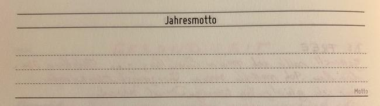

Theme Based Productivity - Eine andere Art der Jahresplanung
############################################################
:date: 2020-02-14 15:00
:author: sascha
:category: Inspiration, Mindfulness, Planer, Produktivität
:status: published

Ich weiß gar nicht genau, wann es anfing. Aber seit ich mich mit Planung auf einer größeren Flughöhe beschäftige (aka Lebensplan), folge ich dem Mantra *"Du brauchst Lebensziele, 5 Jahresziele, Jahresziele, usw."*. Und seit dem scheiterte ich Jahr für Jahr and den Zielen, bzw. deren Erreichung. Insbesondere wenn man in der weiten Welt der Produktivitäts-Blogs und Podcasts unterwegs ist, kann man schnell das Gefühl bekommen, dass man einfach nur zu blöd ist, das auf die Reihe zu bekommen, oder dass man einfach noch nicht das richtige System gefunden hat. Nachdem ich mich über die Jahre von "normalen" Notizbüchern über Bullet Journals zum `Full Focus Planner <https://fullfocusplanner.com/>`__ durchgearbeitet hatte, bin ich zwar einem optimalen operativen Planungstool recht nahe gekommen, aber die Seiten für die Jahresziele blieben im Planer immer leer. Besser gesagt, sie wurden am Anfang des Jahres gefüllt und dann nie weiter beachtet.

Letztes Jahr bin ich dann im `Cortex-Podcast <https://www.relay.fm/cortex>`__ über **Theme Based Productivity** gestolpert und habe angefangen damit zu experimentieren. Das hat mir von Anfang an gut gefallen, weil es den Leistungsdruck aus der Planung nimmt. Anfang des Jahres habe ich mir dann, anstatt die üblichen Jahresziele aufzustellen, Jahresmottos überlegt. Nach einem guten 3/4 Jahr des Experimentierens möchte ich meine bisherigen Eindrücke mit euch teilen.

Theme Based Productivity
------------------------

Auf der `Website <https://www.relay.fm/cortex>`__ (mittlerweile gibt es dafür natürlich auch einen eigen Planer 😉) findet man folgende Definition:

   The idea of Yearly Themes is something that CGP Grey and Myke Hurley have been living by for a number of years. Instead of resolutions, we set an overall idea of how we would like to approach each year or season. This becomes almost like a guiding principle for our work and/or personal lives for that period.

Das heißt anstatt von konkreten Zielen überlegt man sich ein oder mehrere Mottos unter das man ein Jahr stellen möchte. Dieses Motto gibt einem dann den Rahmen innerhalb dessen man sich bewegt. Für mich hat das zu einer unglaublichen Änderung des "Mindsets" geführt und war sehr befreiend.

Ein Motto trägt viel mehr der Tatsache Rechnung, dass das Leben nicht immer geradeaus verläuft und man am Anfang vielleicht auch nicht gar nicht so recht weiß, wo man hin möchte. Vielleicht ist auch ein vermeintliches Ziel auf einmal gar nicht mehr relevant und man nimmt einen Abzweigung. Dieser Weg kann dann aber immer noch im Sinne des Mottos sein. CGP Grey beschreibt das ganz wunderbar in seinem Video `Your New Year's Resolution Has Already Failed <https://www.youtube.com/watch?v=NVGuFdX5guE>`__.

.. raw:: html

    <embed>
      <iframe width="560" height="315" src="https://www.youtube.com/embed/NVGuFdX5guE" frameborder="0" allow="accelerometer; autoplay; clipboard-write; encrypted-media; gyroscope; picture-in-picture" allowfullscreen></iframe>
    </embed>

Eines meiner Mottos für 2020 ist z.B. "Das Jahr der Gesundheit" - ich möchte insgesamt einen gesünderen Lebensstil etablieren. Eine Maßnahme, die ich mir dazu überlegt habe ist, mich vegan zu ernähren. Daraus kann man natürlich ganz wunderbar ein Ziel formulieren. Mir ist jetzt aber schon klar, das ich kein dogmatischer Veganer werden, sondern mich einfach besser ernähren möchte. Bevor ich jetzt anfange ein komplexes Ziel mit Ausnahmen daraus zu formulieren betrachte ich "Vegane Ernährung" einfach als Maßnahme, die in das Motto passt und kann sie entlang des Weges anpassen. "Das Jahr der Gesundheit" gibt dafür aber den richtigen Rahmen vor.

Jetzt kann man natürlich argumentieren, dass man Ziele ja auch flexibel ändern kann. Aber genau das ist der Teil, den ich ziemlich frustrierend fand, da er latent am "Versagen" kratzte.

Meine Mottos für 2020
---------------------

Ein weiterer Vorteil des Ansatzes ist, dass er hilft sich zu fokussieren. Ich habe für 2020 zwei Jahresmottos. Gegen die kann ich alle Projekte und Aktivitäten (sofern sie eine gewisse Relevanz haben) prüfen. Das ist viel einfacher zu handhaben, als eine Reihe von Projekten die man "abarbeiten" muss.

Das Jahr der Umsetzung
~~~~~~~~~~~~~~~~~~~~~~

Ich habe Ende letzten Jahres mit einem Coach ein paar Dinge besprochen, die Auswirkung auf mein berufliches und privates Leben haben. Für mich geht es in 2020 darum, diese in die Umsetzung zu bringen. Das Motto ist ein guter Anker, das jedesmal abzurufen, wenn es relevant wird und gibt mir den Rahmen Entscheidungen zu treffen. Aktuell gibt es zu dem Motto 3 Aktivitäten:

-  Explore: Mich mit einem neuen Technologiethema beschäftigen, das zumindest außerhalb der SAP Welt anfängt, aber vielleicht auch wieder dorthin zurückführt. Aktuell bin ich hier auf dem Pfad Python/Data Science. EInfach aus Spaß an der Freude
-  Refine: *not to share with public*
-  Visibility: Raus aus dem Elfenbeinturm und sich zeigen und in der Community engagieren

.. figure:: /images/2020-02-14_mottos.jpg
   :class: image-process-article-image
   :alt: Die dazugehörige Motto Seiten in meinem eigenen Planer
   :align: center

   Die dazugehörige Motto Seiten in meinem eigenen Planer

Das Jahr der Gesundheit
~~~~~~~~~~~~~~~~~~~~~~~

Habe ich oben ja schon beschrieben. Die aktuellen Aktivitäten sind:

-  Go Vegan: siehe oben
-  Be Free: Jeder Kletterer kennt die Sturzangst und die mentalen Blockaden. Ist glaub ich ein Lebensprojekt die loszuwerden. Zumindest bei mir. Diese Aktivität ist aber ein gutes Beispiel dafür, dass es für mich unglaublich viel Druck rausgenommen hat, das nicht als Projekt zu betrachten. Ich kann ganz entspannt an die Sache rangehen, ohne den Spaß daran zu verlieren
-  Connect: Fahrradfahren kann ein einsamer Sport sein. Den habe ich zu lange alleine gemacht. Mentale Gesundheit, die durch das Zusammensein mit anderen entsteht ist halt auch wichtig 🙂

Resümee
-------

Nachdem ich letztes Jahr schon mal mit kleineren Mottos experimentiert habe, fühlt sich das Jahr 2020 bisher sehr gut an. Ich habe nicht mehr das Gefühl privat irgendwelchen Zielen und ToDos hinterherzuhecheln. Ich fühle mich viel freier und entspannter. Gleichzeitig habe ich aber auch das Gefühl etwas für mich zu tun und mich insgesamt persönlich weiterzuentwickeln. Die Balance ist bisher ziemlich gut. Mal sehen, wies am Ende des Jahres ausschaut.

Einige erinnern sich vielleicht an `meinen eigenen Planer <https://sascha-kiefer.de/mein-eigener-planer-entsteht/>`__. In der letzten Version habe ich die entsprechenden Seiten für die Jahresmottos dort auch eingefügt. Seither schaue ich da bei meinen wöchentlichen Reviews rein. Rufe es mir in Erinnerung und habe die Mottos immer im Hinterkopf. Sie sind ein aktiver Teil meiner Routinen geworden.
