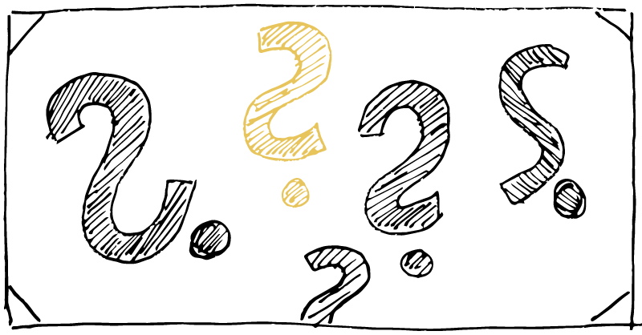

Warum reisen wir zusammen?
##########################
:date: 2015-06-03 22:31
:author: sascha
:category: Verschiedenes
:status: published

Dewi hat mich in einem Kommentar zu meinem `letzten Post <./journey-to-mindfulness-wohin-reisen-wir-eigentlich.html>`__ gefragt, warum ich meine „Selbstfindung“ öffentlich mache.

Das ist eine berechtigte Frage, denn es handelt sich um ein persönliches Thema und ich gebe damit einiges über mich preis. Und das ist genau der Punkt!

Meistens ist die Ursache zur Selbstreflexion und zum Ändern des Verhaltens eine Krise. Auch wenn ich mittlerweile Krisen nicht zwangsläufig als etwas Schlechtes ansehe, so geht es einem in der Zeit doch nicht immer gut und irgend etwas ist aus den Fugen geraten. Aber irgendwie spricht niemand darüber (außer vielleicht ganz enge Freunde, oder jemand der danach ein Buch darüber geschrieben hat).

Es wurde glaube ich nie so viel gelogen, was das eigene Befinden angeht, wie in der heutigen Zeit. Jeder will auf Facebook und Twitter immer toll dastehen und die Statusupdates überschlagen sich quasi vor Superlativen. Auch wenn wir Deutschen gerne jammern (was irgendwie paradox ist), so lassen wir doch eher selten raus, was uns **wirklich** bewegt. Eigentlich ist immer alles prima. Und so etwas wie Zweifel oder Unsicherheit zeigt man ja wohl nicht nach außen. Sollen denn die Leute denken, dass man mit der Leistungsgesellschaft nicht mithalten kann, oder noch schlimmer, nicht mithalten will?

Ich hatte irgendwann genug davon. Ich wollte in einer Zeit, in der es mir nicht gut ging und ich von (Selbst-)Zweifeln und Unsicherheiten getrieben war, nicht mehr so tun als scheine mir die Sonne aus dem Hintern. Also bin ich ein Wagnis eingegangen. Ich habe meine Maske gelüftet. Nur ein wenig, aber ich bin damit ein Risiko eingegangen. Wer sich verletzlich zeigt kann auch verletzt werden. Aber das Interessant ist, dass genau das Gegenteil passierte. Sobald ich den ersten Schritt gemacht habe war das Feedback immer ähnlich. Ich habe gelernt, dass die Meisten sich mit ähnlichen Themen oder gar den Gleichen rumplagen. Viele waren sichtlich erleichtert Bestätigung gefunden zu haben, dass sie nicht alleine sind. Andere haben von ihren Erfahrungen berichtet. Wieder andere haben die Gelegenheit eines tiefsinnigen Gespräches dankbar angenommen um von ihren Problemen zu erzählen. Kein Einziger hat die Gelegenheit genutzt, mir das Messer in den Rücken zu rammen oder mich bloßzustellen. Es sind sehr gute Gespräche entstanden. Aus Kollegen und Kumpel wurden Freunde.

Egal über was wir gesprochen haben, das Thema „mindfulness“ schwang immer mit. Auch wenn ich es zu dem Zeitpunkt noch nicht so benennen konnte. Es ging ganz oft darum, wie man sein Leben sinnvoll gestalte. Herausfindet, was einem wichtig ist. Wie man in Harmonie und Einklang mit sich und anderen lebt. Überraschend viele wollen aus dem Karussell des Höher-Schneller-Weiter ausbrechen und einen Gang zurückschalten. Viele wagen nicht ihr Träume zu träumen geschweige denn sie umzusetzen (interessant, was man alles erfährt, wenn man sich wirklich für jemanden interessiert und anstatt nur den Kopf auch das Herz sprechen lässt). Es scheint also für viele ein Thema zu sein.

Diese Erfahrung hat nicht zum Nachdenken gebracht und ich habe beschlossen, das Verhalten auch beizubehalten, wenn ich nicht grade in einer Krise stecke. Ich habe gelernt mehr von mir preiszugeben und bisher hat es sich gelohnt.

Ich habe auch gelernt besser auf mich und mein Gefühl zu hören und diese zu benennen. Ich habe aber auch gelernt, dass das etwas ist, was wir (im Westen im Allgemeinen und in der IT Branche im Besonderen) erst wieder lernen müssen. Ich weiß aber aus der Erfahrung das es ganz viele Leute gibt, die das wollen, aber ganz wenige, die sich trauen.

Damit schließt sich der Kreis. Das ist der Grund warum ich meinen Prozess öffentlich mache. Ich möchte Mut machen, es einfach zu wagen, von der verkopften Denkweise wegzukommen und die emotionale Ebene auch wieder zu Wort kommen zu lassen. Ich möchte Mut machen, zu wagen, sich nicht immer hinter einer Fassade zu verstecken, sondern sich auf das Experiment der Offenheit einzulassen. Ich möchte zeigen, dass das nichts ist, wovor man Angst haben muss, sondern dass darin Möglichkeiten verborgen liegen. Wenn ihr eine Idee habt, erzählt mal davon, ihr werdet überrascht sein, wie viele unerwartete Möglichkeiten sich ergeben. Teilt eure Leidenschaft. Redet über Dinge die nicht so dolle sind. Seid authentisch und lasst euer Herz sprechen und versteckt euch nicht hinter einer Fassade!

Das soll jetzt kein Aufruf zum kollektiven Seelenstriptease sein. Letztlich muss jeder für sich entscheiden was er wem in welchem Maße preisgibt. Ich kann euch versichern auch ich habe meine Geheimnisse und erzähle nicht alles, aber einiges ;-)
